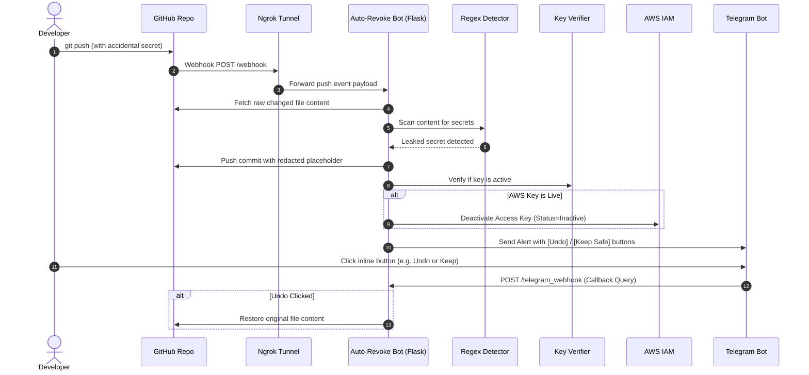

# 🛡️ Auto-Revoke Bot

An automated DevSecOps security bot that detects leaked API keys, tokens, and credentials in GitHub commits in real time, automatically redacts them in your repository, revokes active cloud credentials, and sends instant interactive alerts via Telegram and Slack with one-click undo capabilities.

---

## 📌 Table of Contents

- [Overview](#-overview)
- [How It Works](#-how-it-works)
- [Architecture & Flowchart](#-architecture--flowchart)
- [Supported Secret Types](#-supported-secret-types)
- [Project Structure](#-project-structure)
- [Prerequisites](#-prerequisites)
- [Installation & Setup](#-installation--setup)
- [Configuration (.env)](#-configuration-env)
- [Running the Application](#-running-the-application)
- [Setting Up GitHub Webhook](#-setting-up-github-webhook)
- [Setting Up Telegram Alerts & Interactive Buttons](#-setting-up-telegram-alerts--interactive-buttons)
- [Testing the Bot](#-testing-the-bot)
- [AWS IAM Permissions](#-aws-iam-permissions)
- [Security Best Practices](#-security-best-practices)

---

## 🚀 Overview

Accidentally committing API keys, tokens, or database passwords to public or shared GitHub repositories is a major security hazard. **Auto-Revoke Bot** acts as an automated safety net:

1. **Instant Webhook Ingestion**: Receives GitHub push events whenever code is committed.
2. **Regex Pattern Scanning**: Inspects added and modified files against 20+ secret patterns.
3. **Live Verification**: Checks whether detected credentials (AWS, Telegram, OpenAI) are actively functional.
4. **Auto-Redaction**: Directly modifies the repository via GitHub API to replace sensitive keys with `ENTER_YOUR_API_KEY_HERE`.
5. **Auto-Revocation**: Automatically deactivates live AWS IAM access keys to prevent unauthorized cloud access.
6. **Interactive Alerts**: Sends Telegram alerts containing inline action buttons to keep the redaction or revert (undo) if needed, plus Slack notifications.

---

## 🔄 How It Works



---

## 🔍 Supported Secret Types

The bot's regex engine (`detector.py`) detects:

- **Cloud & Infrastructure**:
  - AWS Access Key IDs (`AKIA...`, `ASIA...`, `AROA...`, etc.)
  - Google Cloud API Keys (`AIza...`)
  - Firebase URLs
  - SSH / RSA / PGP / OpenSSH Private Keys
- **AI & Developer APIs**:
  - OpenAI API Keys (`sk-...`, `sk-proj-...`)
  - GitHub Personal Access Tokens (`ghp_...`, `gho_...`, `ghu_...`, etc.)
  - Slack Bot / User Tokens (`xoxb-...`, `xoxp-...`)
  - Discord Bot Tokens & Webhook URLs
  - Telegram Bot Tokens
  - Twilio, SendGrid, and Mailgun API Keys
- **Payment Processors**:
  - Stripe Test & Live Secret Keys (`sk_test_...`, `sk_live_...`)
  - Stripe Webhook Signing Secrets (`whsec_...`)
- **Databases & Auth**:
  - Database Connection Strings (PostgreSQL, MySQL, MongoDB, Redis)
  - JSON Web Tokens (JWT)
  - Generic Secret / API Key / Password assignment patterns

---

## 📁 Project Structure

```text
auto-revoke-bot/
├── app.py                  # Flask server: Webhook listener & workflow coordinator
├── detector.py             # Regex scanning engine for 20+ secret formats
├── verifier.py             # Active verification tests (AWS STS, Telegram, OpenAI)
├── revoker.py              # AWS IAM key deactivation logic via Boto3
├── github_reverter.py      # GitHub Contents API: Redaction, Deletion & Restoration
├── telegram_notifier.py    # Telegram bot client, inline keyboards & webhook callback handler
├── notifier.py             # Slack incoming webhook notifier
├── aws_iam_policy.json     # Minimum IAM policy template for AWS key deactivation
├── requirements.txt        # Python package dependencies
├── .env.example            # Environment variable template
├── .gitignore              # Files to exclude from version control
└── README.md               # Documentation
```

---

## 📋 Prerequisites

Before running the project, make sure you have:

- **Python 3.8+** installed
- **Git** installed
- **[Ngrok](https://ngrok.com/)** installed (or any public tunneling tool)
- A **GitHub Personal Access Token (Classic)** with `repo` scope
- A **Telegram Bot Token** (from [@BotFather](https://t.me/BotFather)) and your **Telegram Chat ID**
- *(Optional)* **AWS IAM Admin Credentials** (to test AWS revocation)
- *(Optional)* **Slack Incoming Webhook URL** (for Slack notifications)

---

## ⚙️ Installation & Setup

### 1. Clone the Repository
```bash
git clone https://github.com/your-username/auto-revoke-bot.git
cd auto-revoke-bot
```

### 2. Create and Activate a Virtual Environment
- **Windows (PowerShell):**
  ```powershell
  python -m venv venv
  .\venv\Scripts\Activate.ps1
  ```
- **macOS / Linux:**
  ```bash
  python3 -m venv venv
  source venv/bin/activate
  ```

### 3. Install Dependencies
```bash
pip install -r requirements.txt
```

---

## 🔐 Configuration (.env)

Copy `.env.example` to create your local `.env` file:

```bash
cp .env.example .env
```

Open `.env` and fill in your details:

```ini
# ==============================================================================
# AWS IAM Configuration (For Revoking Leaked AWS Access Keys)
# ==============================================================================
ADMIN_AWS_ACCESS_KEY=ENTER_YOUR_ADMIN_AWS_ACCESS_KEY_HERE
ADMIN_AWS_SECRET_KEY=ENTER_YOUR_ADMIN_AWS_SECRET_KEY_HERE
DEMO_LEAKED_SECRET_KEY=ENTER_YOUR_DEMO_LEAKED_SECRET_KEY_HERE

# ==============================================================================
# GitHub Configuration (For Redacting/Restoring Files)
# Generate at: GitHub -> Settings -> Developer Settings -> Personal Access Tokens -> Tokens (classic)
# Required Scope: 'repo'
# ==============================================================================
GITHUB_TOKEN=ENTER_YOUR_GITHUB_TOKEN_HERE

# ==============================================================================
# Ngrok Public URL (Forwarding to port 5000)
# Example: https://abcd-1234.ngrok-free.app
# ==============================================================================
NGROK_URL=ENTER_YOUR_NGROK_URL_HERE

# ==============================================================================
# Telegram Notifications & Interactive Buttons
# Get Bot Token from: @BotFather | Get Chat ID from: @userinfobot or @raw_data_bot
# ==============================================================================
TELEGRAM_BOT_TOKEN=ENTER_YOUR_TELEGRAM_BOT_TOKEN_HERE
TELEGRAM_CHAT_ID=ENTER_YOUR_TELEGRAM_CHAT_ID_HERE

# ==============================================================================
# Slack Notifications (Optional)
# ==============================================================================
SLACK_WEBHOOK_URL=ENTER_YOUR_SLACK_WEBHOOK_URL_HERE
```

---

## 🏃 Running the Application

### Step 1: Start the Local Flask Server
```bash
python app.py
```
The server will start locally on `http://127.0.0.1:5000`.

### Step 2: Expose Local Server with Ngrok
In a separate terminal window, start an ngrok tunnel:
```bash
ngrok http 5000
```
Copy the generated public URL (e.g., `https://xxxx-xxxx.ngrok-free.app`).

### Step 3: Update `NGROK_URL` in `.env`
Paste your ngrok URL into `.env`:
```ini
NGROK_URL=https://xxxx-xxxx.ngrok-free.app
```
Restart `python app.py` so the bot registers its Telegram webhook automatically.

---

## 🔗 Setting Up GitHub Webhook

1. Go to your target GitHub repository.
2. Click **Settings** ➔ **Webhooks** ➔ **Add webhook**.
3. Configure the following settings:
   - **Payload URL**: `https://xxxx-xxxx.ngrok-free.app/webhook`
   - **Content type**: `application/json`
   - **Which events would you like to trigger this webhook?**: Select **Just the push event**.
   - **Active**: Checked ✅
4. Click **Add webhook**.

---

## 🤖 Setting Up Telegram Alerts & Interactive Buttons

1. **Create a Bot**:
   - Message [@BotFather](https://t.me/BotFather) on Telegram and send `/newbot`.
   - Follow instructions and copy the **HTTP API Token**.
2. **Find Your Chat ID**:
   - Message [@userinfobot](https://t.me/userinfobot) or start your new bot and check `https://api.telegram.org/bot<YOUR_TOKEN>/getUpdates`.
   - Copy the numerical ID into `TELEGRAM_CHAT_ID`.
3. When `app.py` runs with `NGROK_URL` set, it automatically calls `register_telegram_webhook()` to register the `/telegram_webhook` callback endpoint.

---

## 🧪 Testing the Bot

1. In a repository monitored by your webhook, commit a file containing a sample test secret:
   ```python
   # test_leak.py
   STRIPE_SECRET = "sk_test_51H8xK2eZvKYlo2C0nJ8abcdefghijklmno"
   ```
2. Push to GitHub:
   ```bash
   git add test_leak.py
   git commit -m "Testing secret detector"
   git push origin main
   ```
3. **What happens**:
   - The Flask server receives the push event.
   - The bot scans `test_leak.py` and detects the Stripe key.
   - The bot commits a replacement to GitHub replacing the key with `ENTER_YOUR_API_KEY_HERE`.
   - A Telegram message is sent with action buttons:
     - ↩️ **Revert this change (Restore)**: Undoes redaction and restores original file.
     - ✅ **Keep Safe (Don't Revert)**: Keeps the redacted version.

---

## 🛡️ AWS IAM Permissions

If using AWS auto-revocation, attach a policy with minimal necessary permissions to the admin credentials used in `ADMIN_AWS_ACCESS_KEY`:

```json
{
    "Version": "2012-10-17",
    "Statement": [
        {
            "Effect": "Allow",
            "Action": [
                "iam:UpdateAccessKey"
            ],
            "Resource": "arn:aws:iam::*:user/demo-leak-user"
        }
    ]
}
```

---

## 🔒 Security Best Practices

- **Never commit `.env`**: Always ensure `.env` is listed in your `.gitignore`.
- **Use Least Privilege**: Restrict the GitHub Personal Access Token and AWS IAM credentials to only the repositories and actions they need.
- **Rotate Compromised Keys Immediately**: Automated redaction prevents future exploitation, but any leaked secret should be considered compromised and rotated immediately at the provider level.

---

## 📄 License

This project is licensed under the [MIT License](LICENSE).
