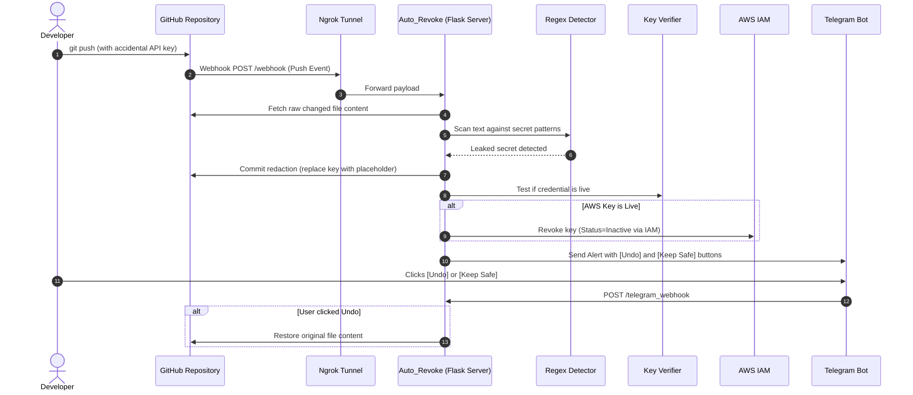

# 🛡️ Auto_Revoke

<div align="center">


**An automated DevSecOps bot that detects leaked API keys and tokens in GitHub commits in real time, auto-redacts the files in your repository, revokes active cloud credentials via IAM, and sends interactive alerts with 1-click undo via Telegram & Slack.**

[Report Bug](https://github.com/iamparasdhingra/Auto_Revoke/issues) · [Request Feature](https://github.com/iamparasdhingra/Auto_Revoke/issues)

</div>

---

## 📌 Table of Contents

- [Overview](#-overview)
- [Key Features](#-key-features)
- [How It Works & Architecture](#-how-it-works--architecture)
- [Supported Secret Types](#-supported-secret-types)
- [Project Structure](#-project-structure)
- [Prerequisites](#-prerequisites)
- [Quick Start Guide](#-quick-start-guide)
- [Environment Configuration (.env)](#-environment-configuration-env)
- [Setting Up GitHub Webhooks](#-setting-up-github-webhooks)
- [Setting Up Telegram Bot & Webhooks](#-setting-up-telegram-bot--webhooks)
- [Testing the Bot](#-testing-the-bot)
- [AWS IAM Permissions Policy](#-aws-iam-permissions-policy)
- [Security Best Practices](#-security-best-practices)
- [Author & License](#-author--license)

---

## 🚀 Overview

Accidentally pushing sensitive credentials (API keys, cloud tokens, database strings) to GitHub is one of the most common and dangerous security vulnerabilities. **Auto_Revoke** acts as an instant, autonomous safeguard:

1. **⚡ Event-Driven Ingestion**: Captures GitHub push events via webhooks.
2. **🔍 Deep Secret Scanning**: Scans all added/modified files across commits using regex patterns for 20+ secret formats.
3. **🧪 Live Verification**: Validates whether detected credentials (AWS STS, Telegram Bot API, OpenAI API) are actively live before acting.
4. **🔒 Autonomous Redaction**: Directly replaces leaked keys in the repository with `ENTER_YOUR_API_KEY_HERE` via the GitHub API.
5. **⚡ Cloud Revocation**: Deactivates live AWS IAM access keys immediately using the AWS Boto3 SDK.
6. **📱 Interactive Notifications**: Dispatches rich Telegram notifications equipped with inline buttons (`↩️ Revert (Restore)` / `✅ Keep Safe`) alongside optional Slack alerts.

---

## ✨ Key Features

- **Real-Time Git Protection**: Zero-polling architecture triggered immediately on `git push`.
- **20+ Secret Formats Supported**: Covers AWS, OpenAI, Stripe, Telegram, Discord, GitHub, Slack, Twilio, SendGrid, database URIs, JWTs, and SSH keys.
- **Automated Repository Remediation**: Immediately edits the file in GitHub to hide the secret from public scraping bots.
- **1-Click Interactive Telegram Undo**: Inadvertent redactions can be restored instantly with a single tap in Telegram.
- **Active Key Verification**: Distinguishes between dead keys and live threats to minimize noise.
- **AWS Key Invalidation**: Instantly turns off compromised AWS IAM keys via administrative credentials.

---

## 🔄 How It Works & Architecture



---

## 🔍 Supported Secret Types

| Category | Supported Credentials / Patterns |
| :--- | :--- |
| **Cloud & Infra** | AWS Access Keys (`AKIA`, `ASIA`, `AROA`, etc.), Google API Keys (`AIza`), Firebase URLs, SSH/RSA/PGP Private Keys |
| **AI & LLMs** | OpenAI API Keys (`sk-...`, `sk-proj-...`) |
| **Developer & Git** | GitHub Personal Access Tokens (`ghp_`, `gho_`, `ghu_`, `ghs_`, `ghr_`), Slack Bot/User Tokens (`xoxb-`, `xoxp-`) |
| **Messaging & Bots** | Telegram Bot Tokens, Discord Bot Tokens & Webhook URLs |
| **Communications** | Twilio API Keys, SendGrid API Keys, Mailgun API Keys |
| **Payments** | Stripe Test/Live Keys (`sk_test_`, `sk_live_`), Stripe Webhook Secrets (`whsec_`) |
| **Databases & Auth** | PostgreSQL, MySQL, MongoDB, Redis Connection URLs, JWT Tokens, Generic Secret assignments |

---

## 📁 Project Structure

```text
Auto_Revoke/
├── app.py                  # Main Flask server: Webhook endpoints & orchestration
├── detector.py             # Multi-pattern regex scanning engine
├── verifier.py             # Live validation (AWS STS, Telegram Bot, OpenAI)
├── revoker.py              # AWS IAM access key deactivation logic
├── github_reverter.py      # GitHub Contents API: Redaction, Deletion & Undo
├── telegram_notifier.py    # Telegram Bot client & inline button callback handler
├── notifier.py             # Slack incoming webhook alerts
├── aws_iam_policy.json     # Sample minimum IAM policy for key deactivation
├── requirements.txt        # Python package dependencies
├── .env.example            # Environment configuration template
├── .gitignore              # Files ignored by git (protects secrets & caches)
└── README.md               # Documentation
```

---

## 📋 Prerequisites

- **Python 3.8+**
- **Git**
- **[Ngrok](https://ngrok.com/)** (or similar tool for tunneling local webhooks)
- **GitHub Personal Access Token (Classic)** with `repo` permissions
- **Telegram Bot Token** (from [@BotFather](https://t.me/BotFather)) & **Chat ID**
- *(Optional)* **AWS IAM Admin Credentials** (to revoke AWS keys)
- *(Optional)* **Slack Webhook URL** (for Slack notifications)

---

## ⚡ Quick Start Guide

### 1. Clone the Repository
```bash
git clone https://github.com/iamparasdhingra/Auto_Revoke.git
cd Auto_Revoke
```

### 2. Set Up Virtual Environment
- **Windows (PowerShell):**
  ```powershell
  python -m venv venv
  .\venv\Scripts\Activate.ps1
  ```
- **macOS / Linux:**
  ```bash
  python3 -m venv venv
  source venv/bin/activate
  ```

### 3. Install Dependencies
```bash
pip install -r requirements.txt
```

---

## 🔐 Environment Configuration (.env)

Create a `.env` file in the root folder by copying the provided template:

```bash
cp .env.example .env
```

Open `.env` and fill in your values:

```ini
# ==============================================================================
# AWS IAM Credentials (For revoking leaked AWS keys)
# ==============================================================================
ADMIN_AWS_ACCESS_KEY=ENTER_YOUR_ADMIN_AWS_ACCESS_KEY_HERE
ADMIN_AWS_SECRET_KEY=ENTER_YOUR_ADMIN_AWS_SECRET_KEY_HERE
DEMO_LEAKED_SECRET_KEY=ENTER_YOUR_DEMO_LEAKED_SECRET_KEY_HERE

# ==============================================================================
# GitHub Configuration (For redacting & restoring files)
# Create at: GitHub -> Settings -> Developer Settings -> Personal Access Tokens (classic)
# Scope: 'repo' (Full control of private/public repositories)
# ==============================================================================
GITHUB_TOKEN=ENTER_YOUR_GITHUB_TOKEN_HERE

# ==============================================================================
# Public Tunnel URL (Forwarding to local port 5000)
# ==============================================================================
NGROK_URL=https://your-subdomain.ngrok-free.app

# ==============================================================================
# Telegram Configuration (For interactive alerts)
# Bot Token from @BotFather | Chat ID from @userinfobot
# ==============================================================================
TELEGRAM_BOT_TOKEN=ENTER_YOUR_TELEGRAM_BOT_TOKEN_HERE
TELEGRAM_CHAT_ID=ENTER_YOUR_TELEGRAM_CHAT_ID_HERE

# ==============================================================================
# Slack Configuration (Optional)
# ==============================================================================
SLACK_WEBHOOK_URL=ENTER_YOUR_SLACK_WEBHOOK_URL_HERE
```

---

## 🏃 Running the Bot

### 1. Start the Flask Application
```bash
python app.py
```
The server will run on `http://127.0.0.1:5000`.

### 2. Expose the Server with Ngrok
In a separate terminal:
```bash
ngrok http 5000
```
Copy your forwarding URL (e.g., `https://xxxx.ngrok-free.app`), set it as `NGROK_URL` in `.env`, and restart `python app.py`.

---

## 🔗 Setting Up GitHub Webhooks

1. Open your target GitHub repository.
2. Navigate to **Settings** ➔ **Webhooks** ➔ **Add webhook**.
3. Fill in the parameters:
   - **Payload URL**: `https://<YOUR_NGROK_URL>/webhook`
   - **Content type**: `application/json`
   - **Which events would you like to trigger this webhook?**: Choose **Just the push event**.
   - **Active**: Ensure the checkbox is checked ✅.
4. Click **Add webhook**.

---

## 🤖 Setting Up Telegram Bot & Webhooks

1. Open Telegram and search for [@BotFather](https://t.me/BotFather).
2. Type `/newbot` and follow the steps to create your bot. Copy the API Token to `TELEGRAM_BOT_TOKEN`.
3. Start a chat with [@userinfobot](https://t.me/userinfobot) to get your numeric ID and put it in `TELEGRAM_CHAT_ID`.
4. When `app.py` boots with `NGROK_URL` configured, it automatically registers `https://<YOUR_NGROK_URL>/telegram_webhook` with Telegram so interactive buttons work out of the box.

---

## 🧪 Testing the Bot

1. In any repository configured with the webhook, add a sample test credential:
   ```python
   # sample_leak.py
   STRIPE_KEY = "sk_test_51H8xK2eZvKYlo2C0nJ8abcdefghijklmno"
   ```
2. Commit and push:
   ```bash
   git add sample_leak.py
   git commit -m "test: test secret leak detection"
   git push origin main
   ```
3. **Observation**:
   - The bot receives the push notification.
   - `Auto_Revoke` scans the commit and detects the Stripe key.
   - An automated commit replaces the key with `ENTER_YOUR_API_KEY_HERE` in your repository.
   - You receive an instant Telegram message with action buttons:
     - ↩️ **Revert this change (Restore)**: Restores the original file.
     - ✅ **Keep Safe (Don't Revert)**: Keeps the sanitized version.

---

## 🛡️ AWS IAM Permissions Policy

To allow `Auto_Revoke` to deactivate compromised keys, attach a policy with minimal necessary permissions to your admin IAM user:

```json
{
    "Version": "2012-10-17",
    "Statement": [
        {
            "Effect": "Allow",
            "Action": [
                "iam:UpdateAccessKey"
            ],
            "Resource": "arn:aws:iam::*:user/demo-leak-user"
        }
    ]
}
```

---

## 🔒 Security Best Practices

- **Keep `.env` Secret**: Ensure `.env` is listed in `.gitignore` and never committed.
- **Principle of Least Privilege**: Grant only necessary permissions to your GitHub Token and AWS IAM credentials.
- **Provider-Side Invalidation**: Automated redaction stops further public exposure, but any leaked key must still be rotated at the provider level immediately.

---

## 👤 Author & License

**Paras Dhingra**
- GitHub: [@iamparasdhingra](https://github.com/iamparasdhingra)
- Repository: [Auto_Revoke](https://github.com/iamparasdhingra/Auto_Revoke)

Distributed under the MIT License. See `LICENSE` for details.
